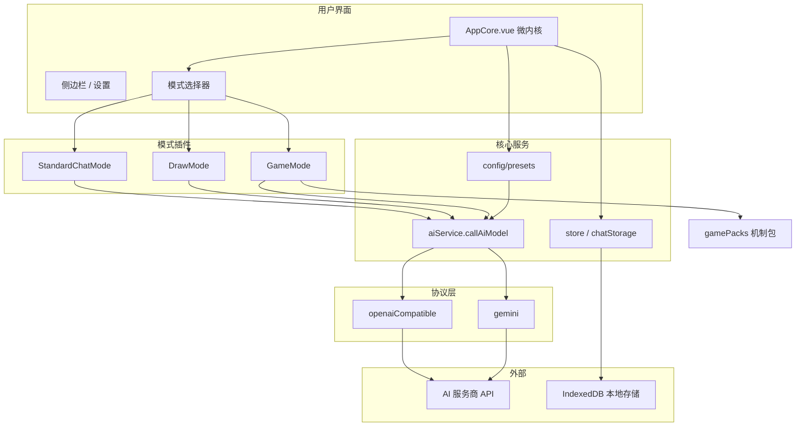

# 项目资源总览

> 面向无技术背景的审阅者、新加入成员、产品/设计/运营协作方。
> 本文整合项目的设计、信息与技术要点，用于快速了解全貌并开展 Review。
>
> 最后更新：2026-07-07

---

## 1. 这份文档解决什么问题

仓库内已有大量专题文档（架构、API、GameMode、存档方案等），分散在不同目录。本文把它们收敛成**一份入口文档**：

- 项目是什么、给谁用
- 能做什么、现在做到哪一步
- 技术怎么组织、数据存在哪
- 去哪里查细节、Review 时该看哪些点

读完本文后，你可以带着明确问题进入各专题文档，而不必从零翻代码。

---

## 2. 项目是什么

**项目名称**：与 AI 的睡前故事 2（Bedtime-Stories-with-AI-2）

**一句话**：运行在浏览器里的 AI 交互应用。用户配置自己的 AI 接口密钥后，可在网页上进行对话、绘图，以及由规则驱动的文本冒险游戏。

**形态**：

- 纯前端 Web 应用（Vue 3 + Vite）
- 无需自建后端即可使用（API Key 存在用户浏览器本地）
- 也支持通过「后端代理」预设，由服务端持有真实密钥
- 线上部署于 GitHub Pages，自定义域名 `ai.tobenot.top`

**作者 / 社区**：tobenot；QQ 群 1028122611

---

## 3. 给谁用、解决什么问题

| 用户类型 | 典型场景 |
|---------|---------|
| 普通用户 | 与 AI 聊天、看推理过程、管理多段对话、导出 PDF/TXT |
| 创作者 | 用绘图模式生成图像；用 GameMode 跑团、文字冒险 |
| 机制包作者 | 编写 JSON 机制包，定义骰子、随机表、触发器、状态面板 |
| 开发者 | 新增「模式」插件（类似独立功能页）、扩展 AI 供应商预设 |

**设计取向**：

- 微内核 + 插件化：核心壳子稳定，功能以「模式」形式插拔
- 供应商无关：通过 Preset（预设）统一管理不同 AI 服务商的连接方式
- 本地优先：对话、密钥、机制包默认保存在浏览器，不经过项目方服务器

---

## 4. 产品功能一览

### 4.1 三种模式（Mode）

应用顶部可切换三种模式，每种模式是独立插件：

| 模式 | ID | 功能摘要 |
|------|-----|---------|
| 标准对话 | `standard-chat` | 流式聊天、多会话、消息编辑/重生/删除、Markdown 与代码高亮、思考过程展示 |
| 绘图 | `draw` | 按预设能力调用支持图像输出的模型，生成图片 |
| 游戏 | `game-mode` | 机制包驱动的文本游戏：状态、工具、触发器、回合制、运行日志 |

### 4.2 全局能力（与模式无关）

- **多供应商预设**：硅基流动、Deepseek、火山引擎、OpenRouter、LMRouter、Google Gemini，以及两个后端代理预设
- **自定义预设**：用户可添加任意 OpenAI 兼容网关
- **会话管理**：侧边栏多对话、标题自动生成、分支（Fork）、搜索
- **存档**：导出/导入 JSON 归档、完整备份（冷热分离 v2）、可选加密
- **设置**：温度、最大 Token、推理强度、模型选择、API Key 按预设分桶存储

### 4.3 GameMode 子系统（重点）

GameMode 是项目中最复杂的子系统，适合单独 Review：

```
玩家输入
  → 回合数 +1
  → 触发器检查（如每 3 回合随机遭遇）
  → AI 决定是否调用工具（骰子 / 随机表 / 遭遇 / 状态检查 / 改状态）
  → 前端执行工具，结果结构化回传 AI
  → AI 生成叙述、选项、状态变更
  → 保存消息与状态快照
```

**机制包（Game Pack）**：声明式 JSON，描述初始状态、UI 面板、工具、触发器、AI 指令、随机池。内置 DND 跑团包、COC 调查包；支持导入自定义包。

**工具类型（已实现）**：`dice`、`table`、`encounter`、`stateCheck`、`patchState`

**运行日志**：侧栏可查看 Debug/Info/Warn/Error 分级日志，用于排查回合流程问题。

---

## 5. 技术栈

| 层次 | 技术 | 用途 |
|------|------|------|
| 框架 | Vue 3 | 界面与组件 |
| 构建 | Vite 4 | 开发服务器、生产打包 |
| UI | Element Plus + Tailwind CSS | 组件库与样式 |
| 内容渲染 | Markdown-It、Highlight.js | 消息 Markdown 与代码高亮 |
| 导出 | html2pdf.js | 对话导出 PDF |
| 存储 | IndexedDB + localStorage | 对话持久化、预设与密钥 |
| 部署 | GitHub Actions + GitHub Pages | `main` 分支推送后自动构建发布 |
| 测试 | Node 原生 test runner | 分支命名等单元测试（`tests/*.test.mjs`） |

**环境要求**：Node.js 18+，npm 9+

**常用命令**：

```bash
npm install    # 安装依赖
npm run dev    # 本地开发，默认 http://localhost:3000
npm run build  # 生产构建，输出 dist/
npm run serve  # 预览构建产物
```

---

## 6. 系统架构

### 6.1 运行主链路

```text
main.js
  → AppCore.vue（微内核：布局、全局状态、模式切换）
    → 模式插件（src/modes/*）
      → callAiModel()（统一 AI 入口）
        → openaiCompatible.js / gemini.js（协议适配）
          → 远端 AI 服务（直连或后端代理）
```

### 6.2 分层结构

```text
┌─────────────────────────────────────────┐
│  L1 模式插件   StandardChat / Draw / Game │
├─────────────────────────────────────────┤
│  L2 统一入口   core/services/aiService   │
├─────────────────────────────────────────┤
│  L3 协议驱动   utils/providers/*         │
├─────────────────────────────────────────┤
│  L4 支撑层     presets / keyManager /    │
│                chatStorage / store       │
└─────────────────────────────────────────┘
```

### 6.3 核心设计原则

1. **单一 AI 入口**：所有模式只调用 `callAiModel()`，不在业务层直接 `fetch`
2. **Preset 是唯一事实源**：`activePresetId` 决定协议、URL、鉴权方式、能力标记
3. **模式可插拔**：新模式 = 新目录 + `plugin.js` + 在 `modes/index.js` 注册
4. **GameMode 工具不外溢**：骰子、随机表等仅在 GameMode 运行时执行，不是全局工具栏插件

### 6.4 架构示意图



---

## 7. 目录结构（Review 用速查）

```text
/workspace
├── README.md                 # 项目主说明（开发者入口）
├── HowToDev.md               # 开发手册
├── docs/                     # 文档目录（本文所在位置）
│   ├── 项目资源总览.md       # ← 本文
│   ├── 架构说明.md
│   ├── 快速开始.md
│   ├── api/                  # AI 调用与 Preset 体系
│   ├── GameMode/             # 游戏模式专题
│   └── chatSave/             # 对话存储方案
├── src/
│   ├── main.js               # 应用入口
│   ├── AppCore.vue           # 微内核主壳
│   ├── core/                 # 插件系统、store、aiService
│   ├── config/presets/       # 内置与自定义预设
│   ├── modes/                # 三种模式插件
│   ├── gamePacks/            # GameMode 内置机制包
│   ├── tools/                # 全局工具插件（如剧本选择器）
│   ├── shared/components/    # 模式共享 UI 组件
│   ├── components/           # 全局 UI（设置、侧边栏等）
│   ├── appCore/methods/      # AppCore 业务方法拆分
│   └── utils/                # 工具函数、协议驱动、存档
├── tests/                    # 单元测试
├── public/                   # 静态资源、CNAME
└── .github/workflows/        # CI 部署到 GitHub Pages
```

---

## 8. 数据、隐私与安全

### 8.1 数据存在哪

| 数据 | 存储位置 | 说明 |
|------|---------|------|
| API Key | localStorage，按 `presetId` 分桶 | 不上传项目服务器 |
| 对话记录 | IndexedDB（`bs2-chat-db`） | 含消息、元数据、GameMode 状态 |
| 自定义预设 | localStorage | 用户创建的 OpenAI 兼容网关配置 |
| 自定义机制包 | localStorage | GameMode 导入的包 |
| 全局偏好 | localStorage（`core/store.js`） | 温度、当前预设 ID 等 |

### 8.2 两种连接 AI 的方式

| 方式 | 用户操作 | 密钥位置 |
|------|---------|---------|
| 直连（`authMode: apiKey`） | 在设置里填自己的 API Key | 用户浏览器 |
| 后端代理（`authMode: password`） | 选择「后端代理」预设，填功能密码 | 真实 Key 在代理服务端 |

### 8.3 审阅关注点

- 纯前端架构：项目方默认不收集对话内容
- 导出/导入：用户可自行备份；支持加密归档
- 后端代理：依赖第三方代理服务的可信性与隐私政策
- 无用户账号体系：换设备需自行导入存档

---

## 9. 部署与访问

| 项目 | 说明 |
|------|------|
| 线上地址 | https://ai.tobenot.top（`public/CNAME`） |
| 构建触发 | 推送到 `main` 分支 → GitHub Actions 自动 `npm run build` → 部署 Pages |
| Vite base | `/`（根路径部署） |
| 许可证 | MIT |

本地与线上一致性：同一套静态资源，无服务端渲染。

---

## 10. 项目现状（2026 年中）

### 10.1 已完成

- 微内核 + 插件化架构重构
- Preset 体系 Phase 0–4（内置/自定义/模型拉取/能力标记）
- 三种模式：标准对话、绘图、GameMode
- GameMode：机制包、五类工具、触发器、状态快照与回退、运行日志
- 对话冷热分离归档（完整备份 v2）
- GitHub Actions 自动部署

### 10.2 进行中 / 待做（摘自开发进度文档）

| 领域 | 待办示例 |
|------|---------|
| GameMode | 流式输出、玩家选择 UI、更多内置机制包 |
| GameMode | `index.vue` 逻辑拆分、单元测试 |
| 平台 | 预设导入/导出、插件市场（远期） |
| 体验 | 工具结果可视化增强（骰子动画、遭遇卡片） |

详细勾选清单见 `docs/GameMode/游戏模式开发进度.md`。

---

## 11. 文档地图

按角色推荐阅读路径：

### 11.1 无技术背景 / 产品 Review

1. **本文** — 全貌
2. `README.md` — 功能列表与快速开始
3. `docs/GameMode/README.md` — 游戏模式做什么
4. `docs/GameMode/机制包制作指南.md` — 机制包作者视角

### 11.2 开发者上手

1. `docs/快速开始.md`
2. `docs/架构说明.md`
3. `docs/插件开发示例.md`
4. `docs/api/API架构梳理.md`
5. `HowToDev.md`

### 11.3 GameMode 深入

| 文档 | 内容 |
|------|------|
| `docs/GameMode/机制包结构.md` | JSON 字段定义 |
| `docs/GameMode/工具基建设计.md` | 工具类型与执行流程 |
| `docs/GameMode/随机池与随机表.md` | 加权随机、标签匹配 |
| `docs/GameMode/触发器.md` | 条件、冷却、次数限制 |
| `docs/GameMode/提示词构造.md` | 三层提示词与缓存 |
| `docs/GameMode/AI工具闭环.md` | AI 请求工具 → 执行 → 回传 |
| `docs/GameMode/存档与导入.md` | 状态快照、Fork、Undo |

### 11.4 基础设施 / 存储

| 文档 | 内容 |
|------|------|
| `docs/api/Preset架构改造方案.md` | Preset 改造阶段记录 |
| `docs/chatSave/冷热分离方案.md` | 对话归档设计与实施状态 |
| `docs/模式开发工具使用指南.md` | Abort、Throttle、StreamJsonParser 等 |
| `REFACTORING_GUIDE.md` | 架构重构背景 |

### 11.5 历史 / 参考（非主路径）

- `docs/chatSave/(不使用)*` — 已否决的存储方案
- `docs/修复日志.md`、`docs/流式输出JSON解析问题报告.md` — 问题记录
- `README_NEW_ARCHITECTURE.md` — 架构升级公告（部分规划已过时，以 README 为准）

---

## 12. Review 检查清单

供无背景审阅者按主题勾选：

### 12.1 产品与体验

- [ ] 三种模式的功能边界是否清晰（聊天 / 绘图 / 游戏）？
- [ ] 新用户能否在设置中完成 API 配置并开始对话？
- [ ] GameMode 开场、回合流程、状态面板是否符合「文字游戏」预期？
- [ ] 导出/导入/加密是否满足用户备份需求？

### 12.2 架构与可维护性

- [ ] 微内核 + 模式插件的分工是否合理？
- [ ] 新增 AI 供应商是否只需改 Preset / Provider，而不动各模式？
- [ ] GameMode 与全局工具系统是否边界清楚（避免概念混淆）？

### 12.3 数据与隐私

- [ ] 本地存储策略是否向用户说明（Key、对话均在本机）？
- [ ] 后端代理模式的风险是否可接受？
- [ ] 归档/完整备份能否恢复冷热数据？

### 12.4 GameMode 机制包

- [ ] JSON 机制包字段是否足够表达常见跑团规则？
- [ ] 内置 DND / COC 包是否可作为模板参考？
- [ ] 工具结果由前端执行、AI 不可伪造——该安全模型是否满足设计目标？

### 12.5 工程与发布

- [ ] `main` 推送后 CI 能否成功构建部署？
- [ ] 文档是否与代码现状一致（尤其 README vs README_NEW_ARCHITECTURE）？
- [ ] 测试覆盖是否满足当前风险（目前仅少量单元测试）？

---

## 13. 关键源码入口（供深入时定位）

| 关注点 | 文件 |
|--------|------|
| 应用入口 | `src/main.js` |
| 微内核 | `src/AppCore.vue` |
| 模式注册 | `src/modes/index.js` |
| AI 统一调用 | `src/core/services/aiService.js` |
| 预设数据 | `src/config/presets/builtin.js`、`index.js` |
| 对话存储 | `src/utils/chatStorage.js` |
| GameMode 入口 | `src/modes/GameMode/index.vue` |
| 机制包运行时 | `src/utils/gamePackRuntime.js` |
| 内置机制包 | `src/gamePacks/builtin.js` |
| 部署配置 | `.github/workflows/deploy.yml`、`vite.config.js` |

---

## 14. 术语表

| 术语 | 含义 |
|------|------|
| 微内核 | `AppCore.vue`，负责壳子、全局状态、加载模式插件 |
| 模式（Mode） | 独立功能页插件，如标准对话、绘图、游戏 |
| 工具（Tool） | 可挂到模式上的小功能；GameMode 内另有专用工具运行时 |
| Preset（预设） | 一组 API 连接配置：协议、地址、模型列表、鉴权方式 |
| 机制包（Game Pack） | GameMode 的规则 JSON：状态、工具、触发器、随机池 |
| 冷热分离 | 活跃对话在热区，归档对话在冷区，减轻启动与保存压力 |
| Tool Loop | AI 请求工具 → 前端执行 → 结果回传 → AI 继续生成 |

---

## 15. 联系与贡献

- 提交 Issue / PR 欢迎参与
- 许可证：MIT（见根目录 `LICENSE`）
- 开发前建议先读 `docs/快速开始.md` 与 `docs/架构说明.md`

---

*本文随项目演进更新；专题细节以各子文档与源码为准。*
